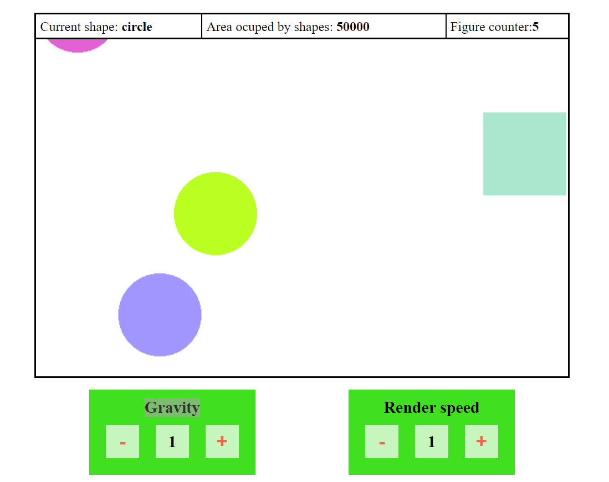
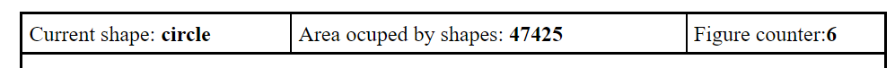
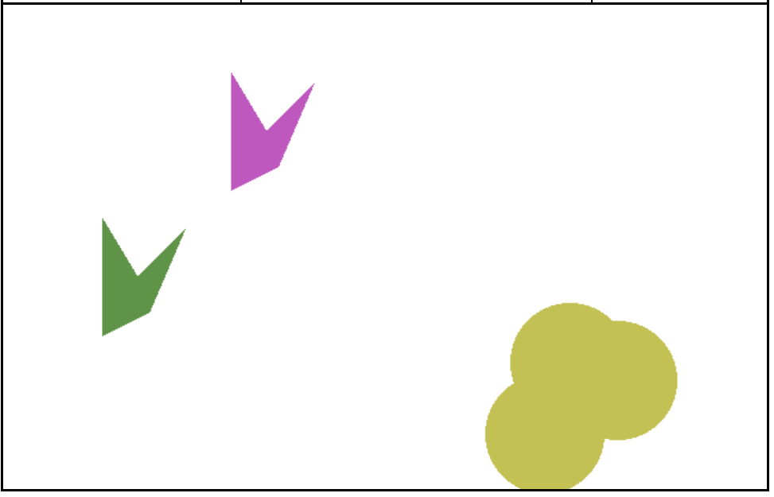
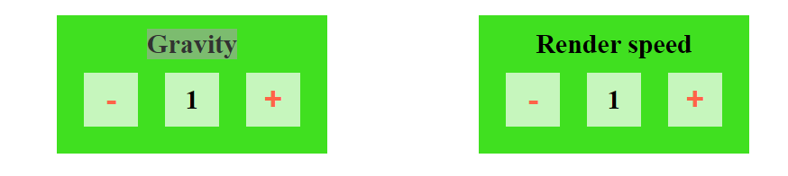

# Welcome to Pixi-App

This is a simple game, wrote using pixi.js without any frameworks.

The application consist of 3 blocks:

### Info-block

Here you can see interactive data about  type of figure just created, calculated area of all figures on the scene in pixels and number of figures on the scene 

### Scene

On default, every second, random figure appears on a scene and moves from top to bottom and with a default speed and disappear. 

You can interact with the scene. When you click on a free space on the scene you create a random figure in this place which start moving down. If you click on a figure, current figure disappear and the same other figures on the scene change their color.

### Control block

Here you can change default speed of figures and interval with which figures appear